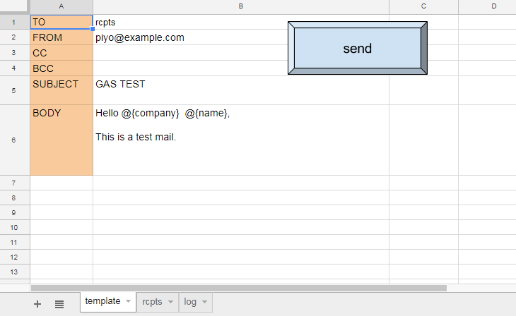
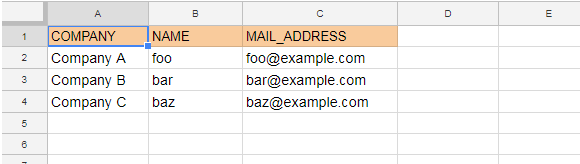

# Send Mail from Spreadsheet using Google Apps Script(GAS)
This is a Google App script(GAS) that send your mail data from a Google Spreadsheet.

## Before you begin
  Create a Google Spreadsheet with three seats.

1 "template" sheet is a mail template. 
   * It needs to have a button to start the script. The initial script name is 'click'. You can create this button from "Insert -> Drawing" on the toolbar. Click the right mouse button on the button, and assign a script name 'click'.
   * Import mail.gs script from 'Tools -> Script editor' on the toolbar.

2 "rcpts" sheet is used to manage recipients.

3 "log" sheet is used to store sent history.

   
## Usage
1 Create a template for mail on "template" sheet.

2 Insert recipients you want to send mail on "rcpts" sheet.

3 Click the button on "template" sheet. After the operation, check the dialogue box to confirm selected operations.

That's all. The transmission history is stored in "log" sheet.

## License
The script is available as open source under the terms of the MIT License.

## Authors
http://alpha-netzilla.blogspot.com/
