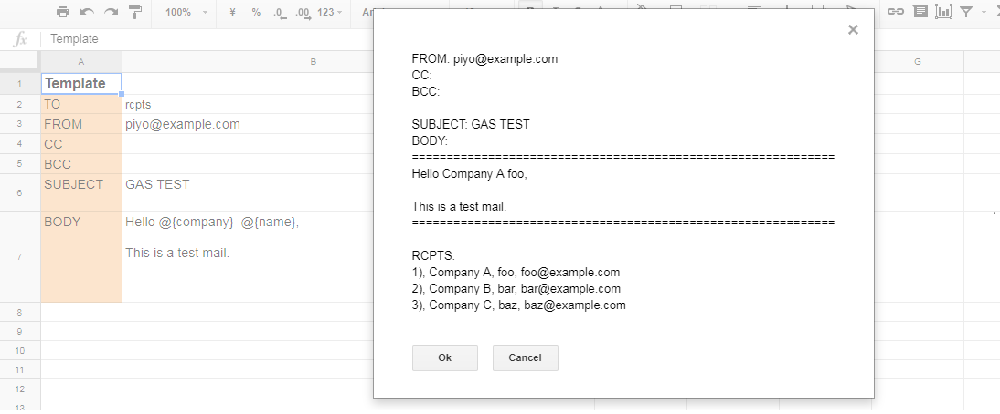

# Send Mail from Spreadsheet using Google Apps Script(GAS)
This is a Google App script(GAS) that send your mail data from a Google Spreadsheet.

# Before you begin
  Create a Google Spreadsheet with three seats.

1 The "template" sheet is a mail template. 
   * Create cells(TO, FROM, CC, BCC, SUBJECT, BODY) just as the image.
   * Create a button to start the script from "Insert -> Drawing" on the toolbar. 
   * Assign a script name 'click' on the button by clicking the right mouse.
   * Import mail.gs script from 'Tools -> Script editor' on the toolbar.

2 The "rcpts" sheet which has three columns(COMPANY, NAME, MAIL_ADDRESS)is used to manage recipients.

3 The "log" sheet which has three columns(DATE, STATUS SUBJECT, TO) is used to store sent history.

   

# Usage
1 Click the button on the "template" sheet. After the operation, check the dialogue box to confirm selected operations.

That's all. The transmission history is stored in "log" sheet.

# License
The script is available as open source under the terms of the MIT License.

# Authors
http://alpha-netzilla.blogspot.com/
